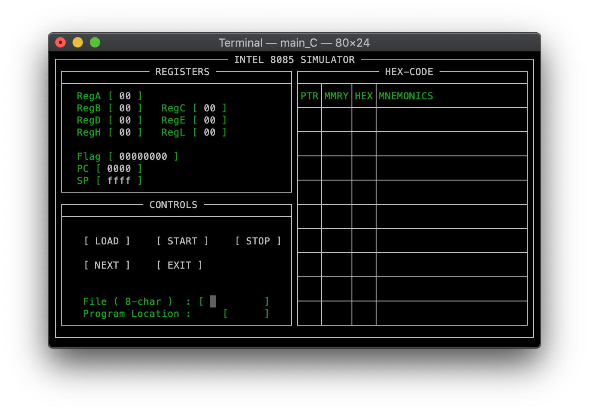

---
---
# Playground: [Repository](https://github.com/code-is-great/code-is-great.github.io).

## vm8085++

This is still working. A project that I wrote in 2002. This is an 8085 simulator written in C++ programming language. The screen was developed using ncurses library. I just checked out and compiled this 17 year old code from the [original repository](http://cvs.savannah.gnu.org/viewvc/vm/vm8085++/).
 

